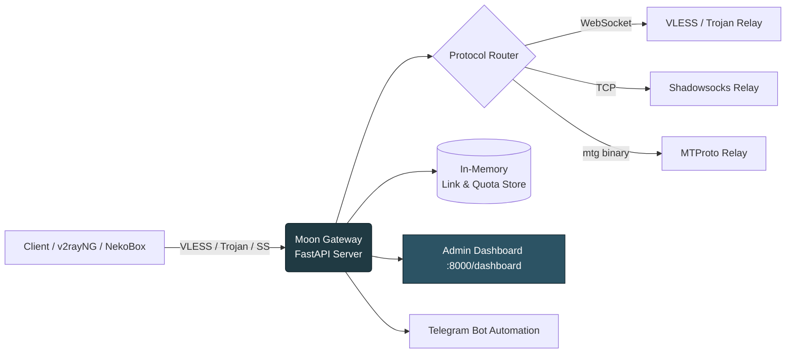
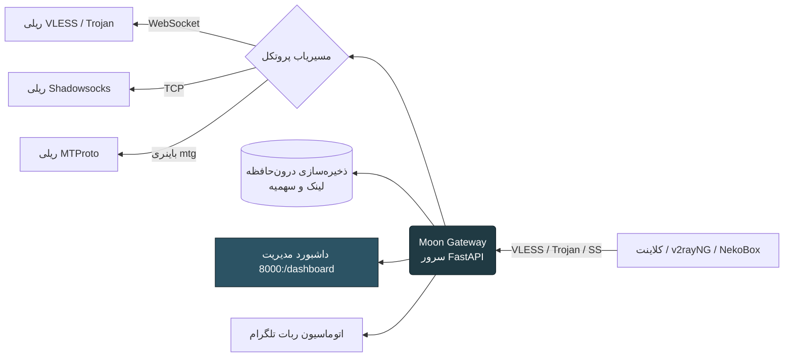

<div align="center">


<a href="#-english"></a>
<a href="#-فارسی"></a>

<br/>


<br/>

[](https://python.org)
[](https://fastapi.tiangolo.com)
[](https://railway.app)
[](./LICENSE)


</div>

<br/>

---

<div align="center">
<h1>🇬🇧 English</h1>
</div>

## 📖 Table of Contents

- [Overview](#-overview)
- [Features](#-features)
- [Supported Protocols](#-supported-protocols)
- [Architecture](#-architecture)
- [Project Structure](#-project-structure)
- [Quick Start (Railway)](#-quick-start-railway-deploy)
- [Local Development](#-local-development)
- [Environment Variables](#-environment-variables)
- [Dashboard Preview](#-dashboard-preview)
- [Roadmap](#-roadmap)
- [Contributing](#-contributing)
- [License](#-license)
- [Ownership and Support](#-ownership-and-support)

<br/>

## 🚀 Overview

**Moon Gateway** is a fast, modern, self-hosted **multi-protocol proxy management panel**, built with **Python + FastAPI**, designed to deploy in minutes on **Railway**.

It gives you a beautiful admin dashboard to create, monitor, and manage proxy links across multiple protocols — with per-link traffic quotas, live connection stats, and QR code generation — all from a single lightweight service.

> 💡 Originally built around a simple VLESS-over-WebSocket relay, Moon has evolved into a full multi-protocol gateway with authentication, quota tracking, and a polished management UI.

> **Provenance:** Moon is a permitted rebrand and modification of [RVG Gateway by CodeBox](https://github.com/arvin341az-glitch/RVG). The original `LICENSE` and copyright notice are retained in this repository.

<br/>

## ✨ Features

<table>
<tr>
<td width="50%">

### 🔌 Core Gateway
- VLESS over WebSocket (TLS 443)
- Trojan, Shadowsocks (AEAD / aes-256-gcm)
- MTProto proxy via `mtg` binary
- Internal HTTP Proxy
- xHTTP / gRPC / HTTPUpgrade transports

</td>
<td width="50%">

### 📊 Management Dashboard
- Real-time traffic charts & trend indicators
- Live connection monitoring
- Unlimited link creation with per-link quotas (MB/GB)
- Instant enable / disable per link
- QR Code export for every link

</td>
</tr>
<tr>
<td width="50%">

### 🛡️ Security & Reliability
- Strict UUID validation
- Session-based authentication
- TLS fingerprint spoofing (Chrome)
- Optimized relay buffers (512KB, `TCP_NODELAY`, `SO_KEEPALIVE`)

</td>
<td width="50%">

### 🤖 Automation
- Telegram-bot-integrated proxy management
- Domain suggestion via Cloudflare Worker
- Automated TCP proxy dispatch with blacklist targeting
- One-click Railway deployment

</td>
</tr>
</table>

<br/>

## 🌐 Supported Protocols

| Protocol | Transport | Status |
|---|---|:---:|
| VLESS | WebSocket / xHTTP / gRPC | ✅ |
| Trojan | WebSocket / HTTPUpgrade | ✅ |
| Shadowsocks | AEAD (aes-256-gcm) | ✅ |
| MTProto | `mtg` v2.1.7 | ✅ |
| HTTP Proxy | Internal | ✅ |

<br/>

## 🏗️ Architecture



<br/>

## 📂 Project Structure

```
 moon/
├── protocol/                 # Per-protocol relay implementations
├── main.py                   # FastAPI app entrypoint
├── central.py                 # Core orchestration logic
├── pages.py                   # Dashboard route/page handlers
├── updater.py                  # Self-update logic
├── botgeneratedomin.py         # Telegram bot: domain generation
├── bottokentcpproxy.py         # TCP proxy automation via Telegram
├── zeussocks5.py                # SOCKS5 proxy handler
├── requirements.txt
├── .gitignore
├── .env.example
├── Procfile
├── NOTICE.md
├── version.txt
└── README.md
```

<br/>

## ⚡ Quick Start (Railway Deploy)

<table>
<tr>
<td width="60px" align="center">1️⃣</td>
<td>

**Create your own repository**

```
Create a repository named `moon` in your GitHub account, then push this source to it.
```

</td>
</tr>
<tr>
<td align="center">2️⃣</td>
<td>

**Deploy on Railway**

1. Go to [Railway.app](https://railway.app)
2. Click **New Project → Deploy from GitHub repo**
3. Select your `moon` repository
4. Railway auto-builds and deploys 🎉

</td>
</tr>
<tr>
<td align="center">3️⃣</td>
<td>

**Enable a public domain**

Railway → Settings → Networking → **Generate Domain**
(this sets `RAILWAY_PUBLIC_DOMAIN` automatically)

</td>
</tr>
<tr>
<td align="center">4️⃣</td>
<td>

**Open your dashboard**

```
https://your-app.up.railway.app/dashboard
```

Copy the default VLESS link and import it into your client (v2rayNG, NekoBox, Streisand, …).

</td>
</tr>
</table>

<br/>

## 💻 Local Development

```bash
# Clone your repository
git clone https://github.com/<your-username>/moon.git
cd moon

# Create a virtual environment
python -m venv venv
source venv/bin/activate   # Windows: venv\Scripts\activate

# Install dependencies
pip install -r requirements.txt

# Run the server
python main.py
```

The dashboard will be available at `http://localhost:8000/dashboard`.

<br/>

## ⚙️ Environment Variables

| Variable | Description | Default |
|---|---|---|
| `PORT` | Port the service runs on | `8000` |
| `ADMIN_PASSWORD` | Required dashboard password; use a long random value | **required** |
| `SECRET_KEY` | Internal security key | Randomly generated |
| `RAILWAY_PUBLIC_DOMAIN` | Public Railway domain (auto-set) | `localhost` |
| `DATA_DIR` | Persistent state directory | `/data` |
| `PUBLIC_DOMAIN` | Optional canonical custom domain used in generated links | Request/Railway host |
| `REDIS_URL` | Optional Redis URL for persistent state | Disabled |
| `CORS_ORIGINS` | Optional comma-separated browser origins | Same-origin only |
| `MOON_SUPPORT_URL` | Optional support link shown in the UI | `https://github.com` |
| `MOON_SUPPORT_LABEL` | Optional support link label | `Moon support` |
| `RAILWAY_PUBLIC_DOMAIN` | Public Railway domain (auto-set) | `localhost` |

<br/>

## 📸 Dashboard Preview

<div align="center">

> Traffic overview • Live connections • Link manager • QR export


</div>

<br/>

## 🗺️ Roadmap

- [x] Multi-protocol relay (VLESS, Trojan, Shadowsocks, MTProto)
- [x] Telegram bot automation
- [x] Traffic dashboard with charts
- [ ] Persistent storage (Redis / PostgreSQL)
- [ ] Multi-node / cluster support
- [ ] Public REST API for external integrations

<br/>

## 🤝 Contributing

Pull requests are welcome for bug fixes, optimizations, and documentation.
> ⚠️ Please read the [LICENSE](./LICENSE) before contributing. Further modification or redistribution must remain within the permission granted by the copyright holder.

<br/>

## 📄 License

The original custom `LICENSE` from RVG is retained in this repository. This copy was renamed and modified with permission from the copyright holder; any further redistribution must follow that license and the copyright holder's permission.

<br/>

## ❤️ Ownership and Support

This copy is prepared for the new owner. Replace this section with your own support links before publishing. Attribution for the original author remains in the Provenance notice and `LICENSE`.

<br/>

---

<br/>

<div align="center" dir="rtl">
<h1>🇮🇷 فارسی</h1>
</div>

## 📖 فهرست مطالب

- [معرفی](#-معرفی)
- [ویژگی‌ها](#-ویژگیها)
- [پروتکل‌های پشتیبانی‌شده](#-پروتکلهای-پشتیبانیشده)
- [معماری](#-معماری)
- [ساختار پروژه](#-ساختار-پروژه)
- [شروع سریع (دیپلوی روی Railway)](#-شروع-سریع-دیپلوی-روی-railway)
- [توسعه محلی](#-توسعه-محلی)
- [متغیرهای محیطی](#-متغیرهای-محیطی)
- [نقشه راه](#-نقشه-راه)
- [مشارکت](#-مشارکت)
- [لایسنس](#-لایسنس)
- [مالکیت و پشتیبانی](#-مالکیت-و-پشتیبانی)

<br/>

## 🚀 معرفی

**Moon Gateway** یک پنل مدیریت پروکسی چندپروتکلی، سریع و مدرن است که با **Python + FastAPI** ساخته شده و در چند دقیقه روی **Railway** قابل دیپلوی است.

این پروژه یک داشبورد مدیریتی زیبا در اختیارتان می‌گذارد تا لینک‌های پروکسی را در پروتکل‌های مختلف بسازید، مانیتور کنید و مدیریت کنید — همراه با محدودیت ترافیک اختصاصی برای هر لینک، آمار اتصالات زنده و خروجی QR Code، همه از طریق یک سرویس سبک و یکپارچه.

> 💡 این پروژه که ابتدا یک ریلی ساده VLESS روی WebSocket بود، اکنون به یک دروازه کامل چندپروتکلی با احراز هویت، مدیریت سهمیه و رابط کاربری حرفه‌ای تبدیل شده است.

<br/>

## ✨ ویژگی‌ها

<table dir="rtl">
<tr>
<td width="50%">

### 🔌 هسته دروازه
- VLESS روی WebSocket (TLS 443)
- Trojan، Shadowsocks (AEAD / aes-256-gcm)
- پروکسی MTProto از طریق باینری `mtg`
- HTTP Proxy داخلی
- ترنسپورت‌های xHTTP / gRPC / HTTPUpgrade

</td>
<td width="50%">

### 📊 داشبورد مدیریتی
- نمودار ترافیک لحظه‌ای و شاخص‌های روند
- مانیتورینگ اتصالات زنده
- ساخت لینک نامحدود با محدودیت ترافیک اختصاصی (MB/GB)
- فعال/غیرفعال‌سازی آنی هر لینک
- خروجی QR Code برای هر لینک

</td>
</tr>
<tr>
<td width="50%">

### 🛡️ امنیت و پایداری
- اعتبارسنجی دقیق UUID
- احراز هویت مبتنی بر سشن
- جعل فینگرپرینت TLS (Chrome)
- بافرهای بهینه‌شده ریلی (۵۱۲ کیلوبایت، `TCP_NODELAY`، `SO_KEEPALIVE`)

</td>
<td width="50%">

### 🤖 اتوماسیون
- مدیریت پروکسی یکپارچه با ربات تلگرام
- پیشنهاد دامنه از طریق Cloudflare Worker
- ارسال خودکار پروکسی TCP با هدف‌گیری بلک‌لیست
- دیپلوی با یک کلیک روی Railway

</td>
</tr>
</table>

<br/>

## 🌐 پروتکل‌های پشتیبانی‌شده

| پروتکل | ترنسپورت | وضعیت |
|---|---|:---:|
| VLESS | WebSocket / xHTTP / gRPC | ✅ |
| Trojan | WebSocket / HTTPUpgrade | ✅ |
| Shadowsocks | AEAD (aes-256-gcm) | ✅ |
| MTProto | `mtg` v2.1.7 | ✅ |
| HTTP Proxy | داخلی | ✅ |

<br/>

## 🏗️ معماری



<br/>

## 📂 ساختار پروژه

```
moon/
├── protocol/                 # پیاده‌سازی ریلی هر پروتکل
├── main.py                   # نقطه ورود اپلیکیشن FastAPI
├── central.py                 # منطق اصلی هماهنگ‌سازی
├── pages.py                   # هندلر مسیرها/صفحات داشبورد
├── updater.py                  # منطق به‌روزرسانی خودکار
├── botgeneratedomin.py         # ربات تلگرام: تولید دامنه
├── bottokentcpproxy.py         # اتوماسیون پروکسی TCP از طریق تلگرام
├── zeussocks5.py                # هندلر پروکسی SOCKS5
├── requirements.txt
├── .gitignore
├── .env.example
├── Procfile
├── NOTICE.md
├── version.txt
└── README.md
```

<br/>

## ⚡ شروع سریع (دیپلوی روی Railway)

<table dir="rtl">
<tr>
<td width="60px" align="center">1️⃣</td>
<td>

**ساخت ریپازیتوری شخصی**

```
در حساب GitHub خود یک ریپازیتوری با نام `moon` بسازید و این سورس را داخل آن push کنید.
```

</td>
</tr>
<tr>
<td align="center">2️⃣</td>
<td>

**دیپلوی روی Railway**

۱. وارد [Railway.app](https://railway.app) شوید
۲. روی **New Project → Deploy from GitHub repo** کلیک کنید
۳. ریپازیتوری `moon` خود را انتخاب کنید
۴. Railway به‌صورت خودکار پروژه را می‌سازد و دیپلوی می‌کند 🎉

</td>
</tr>
<tr>
<td align="center">3️⃣</td>
<td>

**فعال‌سازی دامنه عمومی**

Railway ← Settings ← Networking ← **Generate Domain**
(این کار متغیر `RAILWAY_PUBLIC_DOMAIN` را خودکار تنظیم می‌کند)

</td>
</tr>
<tr>
<td align="center">4️⃣</td>
<td>

**باز کردن داشبورد**

```
https://your-app.up.railway.app/dashboard
```

لینک پیش‌فرض VLESS را کپی کرده و در کلاینت دلخواه (v2rayNG، NekoBox، Streisand و...) وارد کنید.

</td>
</tr>
</table>

<br/>

## 💻 توسعه محلی

```bash
# کلون کردن ریپازیتوری شما
git clone https://github.com/<your-username>/moon.git
cd moon

# ساخت محیط مجازی
python -m venv venv
source venv/bin/activate   # ویندوز: venv\Scripts\activate

# نصب وابستگی‌ها
pip install -r requirements.txt

# اجرای سرور
python main.py
```

داشبورد در آدرس `http://localhost:8000/dashboard` در دسترس خواهد بود.

<br/>

## ⚙️ متغیرهای محیطی

| متغیر | توضیح | پیش‌فرض |
|---|---|---|
| `PORT` | پورت اجرای سرویس | `8000` |
| `ADMIN_PASSWORD` | رمز ورود پنل؛ یک مقدار طولانی و تصادفی وارد کنید | **الزامی** |
| `SECRET_KEY` | کلید امنیتی داخلی | تولید تصادفی |
| `RAILWAY_PUBLIC_DOMAIN` | دامنه عمومی Railway (خودکار) | `localhost` |
| `DATA_DIR` | مسیر ذخیره‌سازی پایدار state | `/data` |
| `PUBLIC_DOMAIN` | دامنهٔ اختصاصی اختیاری برای لینک‌های تولیدشده | دامنهٔ درخواست/Railway |
| `REDIS_URL` | آدرس اختیاری Redis برای state پایدار | غیرفعال |
| `CORS_ORIGINS` | originهای مجاز مرورگر، جداشده با کاما | فقط same-origin |
| `MOON_SUPPORT_URL` | لینک اختیاری پشتیبانی در رابط کاربری | `https://github.com` |
| `MOON_SUPPORT_LABEL` | عنوان لینک پشتیبانی | `Moon support` |

قبل از اولین اجرا، `ADMIN_PASSWORD` را تنظیم کنید. Moon عمداً رمز پیش‌فرض ناامن نسخهٔ اصلی را قبول نمی‌کند.

<br/>

## 🗺️ نقشه راه

- [x] ریلی چندپروتکلی (VLESS، Trojan، Shadowsocks، MTProto)
- [x] اتوماسیون ربات تلگرام
- [x] داشبورد ترافیک با نمودار
- [ ] ذخیره‌سازی دائمی (Redis / PostgreSQL)
- [ ] پشتیبانی چندنودی / کلاستر
- [ ] API عمومی REST برای یکپارچه‌سازی با سرویس‌های دیگر

<br/>

## 🤝 مشارکت

پول‌ریکوئست برای رفع باگ، بهینه‌سازی و مستندسازی خوش‌آمد است.
> ⚠️ لطفاً قبل از مشارکت، فایل [LICENSE](./LICENSE) را مطالعه کنید. هر تغییر یا بازنشر بعدی باید در محدودهٔ اجازهٔ دارندهٔ copyright باشد.

<br/>

## 📄 لایسنس

فایل `LICENSE` اصلی پروژهٔ RVG در این مخزن حفظ شده است. این نسخه با اجازهٔ دارندهٔ copyright تغییر نام و اصلاح شده؛ بازنشر نسخه‌های بعدی باید مطابق همان مجوز و اجازهٔ دارندهٔ copyright باشد.

برای جزئیات کامل به فایل [LICENSE](./LICENSE) مراجعه کنید.

<br/>

## ❤️ مالکیت و پشتیبانی

این نسخه برای استفادهٔ مالک جدید آماده شده است. قبل از انتشار عمومی، لینک پشتیبانی و اطلاعات تماس خودت را جایگزین کن؛ attribution مربوط به نویسندهٔ اصلی در بخش Provenance و فایل `LICENSE` باقی می‌ماند.

<br/>


